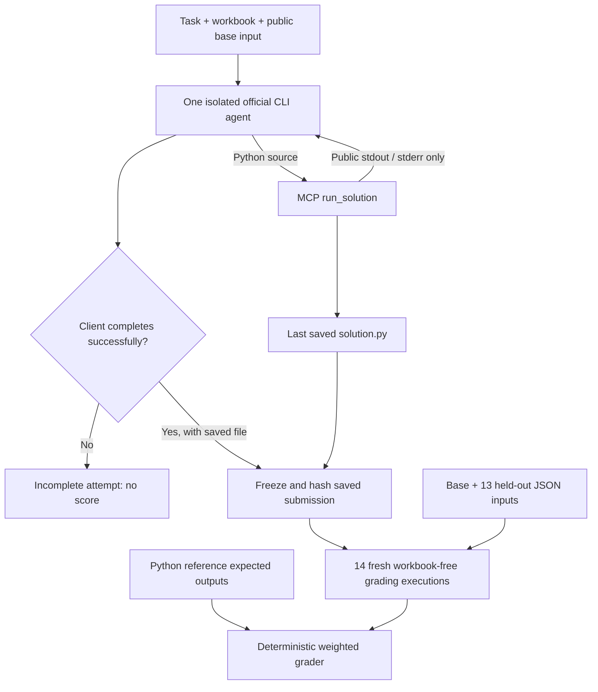

# Damodaran FCFF coding benchmark — pilot report

**Task:** `damodaran_fcff2st`, v0.1

**Recorded finance attempts:** 2026-10-04, UTC

**Scope:** one workbook's active valuation branches; Python generation through API, browser, and official native-agent interfaces.

## 1. Conclusion first

**Not every attempt passed.** Nine persisted finance attempts produced three frozen, graded submissions: **100/100, 0/100, and 100/100**. The other six attempts ended without a graded submission because of provider quota, service demand, or browser message limits. A missing score is not zero.

- **Gemini 3.8 Flash through Gemini CLI:** its first completed submission scored **100/100**, including all 13 held-out scenarios. The later paired attempt was interrupted, and its recovery hit daily quota before generating a candidate.
- **Mistral Medium 3.5 through Vibe:** the first submission scored **0/100** after spending the execution budget on workbook inspection. A separate subsequent attempt scored **100/100**, including all 13 held-out scenarios.
- **Direct Mistral API:** three attempts failed before producing a model response. A successful small-model diagnostic was not substituted for Medium.
- **Mistral browser:** inspection progressed through a local Python bridge, but a message limit prevented a final submission. Its underlying model identity was not verified.
- **OpenAI/Luna target:** an input package was prepared; there is no recorded candidate or score.

**Supported conclusion:** two frozen artifacts satisfied this tested numerical contract; another attempt failed its standalone-submission contract. The harness also exposed real execution-budget and provider-access limitations. These are useful pilot findings, **not a defensible model ranking or a general finance capability certification**.

[Machine-readable ledger and CSV](../results/damodaran_fcff2st/pilot-2026-10-04/README.md) · [Research-backed benchmark assessment](benchmark_design.md) · [Failure taxonomy](failure_taxonomy.md)

## 2. What the models were asked to do

The task was to produce one standalone `solution.py` implementing the active two-stage free-cash-flow-to-firm logic in Aswath Damodaran's supplied `fcff2st.xlsx` workbook. At grading time, the program must read one JSON object from stdin and emit one JSON object on stdout, without opening the workbook or depending on previous executions.

The public development materials were the [task specification](../tasks/damodaran_fcff2st/task.md), the workbook, and [base-case inputs](../tasks/damodaran_fcff2st/inputs/base_case.json). The fixed Yes/No spreadsheet switches define v0.1's scope; held-out scenarios vary numeric assumptions, not every possible workbook branch.

The financial contract covers:

- CAPM cost of equity, market-value capital weights, after-tax cost of debt, and WACC;
- historical EBIT growth, fundamental return on capital and reinvestment, and weighted growth estimates;
- high-growth FCFF and discounting over a variable horizon;
- stable reinvestment from growth/return-on-capital, next-period terminal FCFF and terminal value;
- the firm-to-equity bridge, cash, debt, outstanding options, and per-share value.

The models were judged against **executable calculations and a specified I/O contract**, not prose quality, agreement with another chatbot, or a human impression of plausibility.

## 3. How the task and tests were made

### 3.1 Reference construction and financial ground truth

The spreadsheet's active formulas were transcribed into an [independent Python reference](../reference/damodaran_fcff2st/reference.py), with [stored base outputs](../reference/damodaran_fcff2st/expected_outputs.json). Damodaran's own materials anchor the financial conventions: [spreadsheet collection](https://pages.stern.nyu.edu/~adamodar/New_Home_Page/eqspread.htm), [growth and reinvestment](https://pages.stern.nyu.edu/~adamodar/New_Home_Page/valquestions/growth.htm), and [terminal value/excess returns](https://pages.stern.nyu.edu/~adamodar/New_Home_Page/valquestions/termvalueexreturns.htm). See the repository's [source notes](../reference/damodaran_fcff2st/SOURCES.md).

For this publication, the original frozen workbook was checked again against both the reference calculation and stored expected outputs:

| Oracle check | Observed result |
|---|---:|
| Reference output fields checked | 28 |
| Scalar/array-element numerical comparisons | 36 |
| Largest absolute difference from cached workbook values | 2.1827872842550278e-11 |
| Example: equity value per share | approximately 66.78256422156092 |

[Every checked field, cell/expression, and value is recorded here](../results/damodaran_fcff2st/pilot-2026-10-04/oracle_check.json). Stable reinvestment is derived from cached stable growth and ROC rather than read from a dedicated output cell. The workbook loader warned that an unsupported header/footer could not be parsed; numerical comparisons still succeeded.

**Oracle limitation:** this checks cached base-case values, not a fresh Excel recalculation. Held-out expected outputs come from the Python reference, not independent workbook recalculation for every changed input. The reference is a separate implementation, not an independently audited financial standard.

### 3.2 Held-out scenarios

The [case generator](../evaluator/hidden_cases.py) creates **nine targeted cases plus four deterministic randomized cases**, using seed **20261003** for the reported results.

| Scenario | Intended defect or behavior exercised |
|---|---|
| `discount_rate_shift` | Recompute costs of capital when rate, beta, and tax assumptions change |
| `short_high_growth_horizon` | Forecast and discount over three years, not a hard-coded five |
| `long_high_growth_horizon` | Forecast and discount over eight years |
| `mixed_growth_sources` | Combine historical, outside, and fundamental growth with weights 0.25/0.35/0.40 |
| `reinvestment_and_working_capital` | Recompute reinvestment and working-capital-driven cash flows |
| `capital_structure_shift` | Use changed capital weights and financing assumptions |
| `equity_bridge_shift` | Propagate changes through cash/debt/options/shares into equity value |
| `interest_expense_invariance` | Do not subtract financing interest from FCFF; changing interest expense should leave these outputs unchanged |
| `scale_invariance_x2` | Scale currency amounts and shares together while preserving per-share valuation |
| `seeded_random_1` through `seeded_random_4` | Combine varied valid numeric assumptions instead of testing only isolated changes |

The suite does not cover every valid endpoint, invalid-input behavior, or inactive workbook switch. The 13 scenarios are related tests of the same program, **not 13 independent model-generation samples**.

These inputs and the reference were withheld from the agent workspaces during native generation. Once disclosed in the repository, v0.1 is a public reproduction/regression suite—not a secret future holdout.

### 3.3 Exact scoring rules

The [deterministic grader](../evaluator/grader.py) scores **23 required output fields: 21 scalars and two arrays**. The reference returns five additional intermediate fields that are not separately scored. Extra candidate fields are allowed.

| Scoring block | Weight | Fields |
|---|---:|---|
| Discount rates | 15% | Cost of equity, equity weight, after-tax debt cost, debt weight, WACC |
| Growth and reinvestment | 15% | Historical growth, fundamental ROC, reinvestment rate, fundamental growth, weighted growth, working-capital/revenue ratio |
| High-growth FCFF | 25% | Current FCFF, forecast FCFF array, forecast present-value array |
| Terminal value | 20% | Stable reinvestment, terminal FCFF, stable WACC, terminal value |
| Valuation bridge | 25% | PV of high-growth cash flows, PV of terminal value, firm value, market equity value, equity value per share |

- Numeric matching uses `math.isclose`, relative tolerance **1e-5** and absolute tolerance **1e-6**. Booleans and non-finite/non-numeric values are not valid numerical matches.
- A correctly sized array receives the fraction of matching elements; a wrong type or length receives zero for that field.
- Each block averages its field scores, then receives the weight above.
- **Overall score = 20% × public base-case score + 80% × mean of the 13 held-out case scores.**
- Process failure, invalid JSON, or a non-object output gives that case zero.
- `hidden_cases_passed_95` counts cases scoring **at least 95**, not necessarily perfect cases. Both 100-point submissions actually received full credit throughout.
- A grader process exiting successfully means it produced a report; it does **not** mean the candidate passed.

No LLM judge assigned these scores.

## 4. How the runs executed

### 4.1 Native-agent workflow

Each terminal attempt used a fresh public workspace outside the repository, isolated client configuration, and one logical tool, `run_solution(code)`. That tool overwrites `solution.py`, runs it on the original public JSON input, and returns public execution output. **The last accepted save is the submission**; an over-budget call cannot replace it.

| Control | Terminal condition |
|---|---|
| Configured model-turn cap | 20; native client turn semantics can differ |
| Accepted Python execution cap | 12 |
| Per-development-execution timeout | 10 seconds |
| Overall terminal deadline | 900 seconds |
| Candidate output cap | 64 KiB per stream |
| Final grading | Fresh directory for every case; only copied `solution.py`; 5-second default per case |
| Candidate isolation | macOS profile configures private/repository/network/fork denial and credential-free environment construction; tests exercised private-file/symlink/network denial, not every configured protection |
| Persistent MCP state | Execution count and original public stdin survive server restart |
| Agent audit | Reject observed native-tool use outside the allowed tool or observed requested-model changes |

The Python sandbox is the isolated execution boundary. The native clients themselves still contact their providers; this is not a claim that provider clients have no network access or that the entire host is a security container. The implementation fails closed without the supported macOS sandbox.

Credential-canary, direct fork-denial, direct grader/reference-path access, and broader native-client adversarial checks are not recorded in the published verification. See the [tested-controls matrix](../BENCHMARK_SUMMARY.md#c-leakage-grading-exploits-and-evidence-gaps) for the boundary between observed behavior and configured protections.

### 4.2 Conditions that were not identical

| Interface | Selection/authentication | Generation settings and limitations |
|---|---|---|
| Direct Mistral API | `mistral-medium-3-5`, API key | Temperature 0; 8,192 max completion tokens per turn; no completion obtained |
| Mistral Vibe 2.25.8 | Display alias `mistral-medium-3.5`; configured API alias `mistral-vibe-cli-latest`; Vibe account authentication | Temperature 1, high thinking; immutable backend revision not exposed in saved events |
| Gemini CLI 0.29.5 | `gemini-3.8-flash`; API-key authentication | CLI generation defaults; selected-model evidence retained, not a provider-signed immutable backend revision |
| Mistral browser | Vibe Work, Fast mode, browser account | Underlying model unverified; chat-mediated local Python; native browser tools also observed; not equivalent to the one-tool terminal condition |

Four terminal attempts—the two `pilot-01` and two `paired-02` runs—used identical prompt bytes, public-file manifests, and configured execution/turn/wall limits. The paired native execution intervals overlapped for **118.927 seconds**. Gemini did not finish that paired attempt, so this is not a completed paired performance comparison.

The source workbook changed before `gemini-cli-recovery-03`. Its hash differs and it is explicitly excluded from the four-run matching-input claim. No candidate executed in that recovery, so it produced no affected numerical score. The original input bundle was preserved separately; the changed source workbook was not overwritten.

Prompt, input, and comparison hashes are in the [comparison record](../results/damodaran_fcff2st/pilot-2026-10-04/comparison.json). The pilot was conducted while the harness was being hardened; exact immutable per-run harness-build attestations were not retained. Earlier Gemini evidence predates the later native-session/settings retention. The published source is the verified current snapshot, not proof of byte-identical harness code in every historical attempt.

## 5. Every recorded finance attempt

Times below are UTC on 2026-10-04, rounded to seconds for readability. Exact timestamps and manifests are in [attempts.json](../results/damodaran_fcff2st/pilot-2026-10-04/attempts.json); [attempts.csv](../results/damodaran_fcff2st/pilot-2026-10-04/attempts.csv) is spreadsheet-friendly.

| Attempt | Time interval | Accepted Python calls | Score | Held-out ≥95 | Outcome |
|---|---|---:|---:|---:|---|
| `mistral-20261004T054151151395Z` | 05:41:51–05:41:51 | 0 | — | — | Direct API HTTP429 before first response |
| `mistral-20261004T054227660237Z` | 05:42:27–05:42:27 | 0 | — | — | Direct API HTTP429/code1300 |
| `mistral-20261004T054339102286Z` | 05:43:39–05:43:39 | 0 | — | — | Direct API HTTP429/code1300 |
| `mistral-browser-2026-10-04T05-58-38-478Z` | 05:59:25–06:18:50 | 9 | — | — | Browser message limit; no final submission |
| `gemini-cli-pilot-01` | 06:42:20–06:45:09 | 9 | **100** | **13/13** | Frozen standalone solution |
| `mistral-cli-pilot-01` | 15:08:43–15:12:25 | 12 | **0** | **0/13** | Final implementation arrived after execution budget; inspection script remained frozen |
| `mistral-cli-paired-02` | 15:24:06–15:26:11 | 10 | **100** | **13/13** | Frozen standalone solution |
| `gemini-cli-paired-02` | 15:24:06–15:27:10 | 6 | — | — | Service demand/request limits; partial source only |
| `gemini-cli-recovery-03` | 15:31:16–15:31:25 | 0 | — | — | Daily quota exhausted before candidate generation |

**Denominators:** nine finance attempts; three graded submissions; six ungraded infrastructure interruptions; **46 accepted finance Python executions**. The three historical grades contain **42 case outcomes** (three public and 39 held-out), not 42 independent generation attempts. Within the five terminal attempts, three were graded and two failed before freezing.

### What happened inside the attempts

- **Browser:** first two `openpyxl` inspections timed out after 10 seconds; the next seven standard-library inspections exited successfully. Uploads stalled, so the task was delivered through chat and Python was executed through a local bridge. Nine model responses/calls were recorded before the browser message limit. No completed valuation program was graded.
- **Gemini pilot:** nine accepted executions, then a frozen solution. Transient provider 503 retries occurred inside the client, but the attempt completed and its public/held-out scores were all 100.
- **Mistral pilot:** all 12 accepted executions exited 0, but the frozen file still calls `openpyxl.load_workbook('fcff2st.xlsx', data_only=True)`. The thirteenth requested execution was refused before overwriting the file. Grading intentionally provides no workbook, so every case fails. This is a **budget/submission-management and standalone-file-dependency failure**, not evidence that the rejected final valuation formulas were numerically wrong. The rejected code was not rescued or graded.
- **Mistral paired attempt:** ten accepted executions, no rejected execution requests in its audit, all execution exit codes 0, then a frozen solution scoring 100 throughout.
- **Gemini paired attempt:** six successful execution calls before provider 503/high-demand and request-limit failures. The client exited 247. Partial code is not a frozen submission and received no score.
- **Gemini recovery:** one operator recovery after a recorded 230.668-second cooldown. No prompt/model/limit changes; no supported 503-backoff setting was substituted. The client immediately reported a daily quota of 20 and a reset around 2026-10-05 00:00 UTC. Zero candidate executions. The user retained the API condition; no replacement client, billing change, or automatic future run was scheduled.

[execution_trace.json](../results/damodaran_fcff2st/pilot-2026-10-04/execution_trace.json) records each accepted execution's source hash, exit code, and output byte counts. It deliberately contains no raw reasoning, output transcripts, invented per-call timings, or credentials. Accepted executions are not the same thing as provider requests, model responses, or model turns; native retries consume provider capacity separately.

### Efficiency evidence and limits

Metadata elapsed intervals include preflight/client overhead: approximately 169 seconds for the successful Gemini pilot, 223 seconds for the zero-score Mistral pilot, 125 seconds for the successful Mistral paired attempt, 184 seconds for the interrupted Gemini pair, and 9 seconds for the quota-blocked recovery. These are observations, not a controlled speed ranking.

Gemini's native counters report 293,615 total tokens for its successful pilot and 88,151 for the failed paired attempt. The native fields have client-specific semantics and are retained as reported; displayed components do not simply sum to those totals. Comparable Vibe usage and measured per-attempt monetary cost are absent. No standardized token-efficiency or dollar-cost comparison is claimed.

## 6. Diagnostics, setup, and checks that are not model scores

### Persisted non-finance evidence

| Episode | Observation | Interpretation |
|---|---|---|
| Browser capability probe | Python unavailable; native TypeScript `6*7` returned 42 | Motivated local Python bridge, not a finance result |
| Medium diagnostic at 06:08:25 UTC | `mistral-medium-3-5`, 16-token cap, HTTP 429, effective request limit 0 | Model listing/dashboard allowance did not establish completion access |
| Medium diagnostic at 06:08:27 UTC | `mistral-medium-latest`, same outcome | Alias substitution did not resolve the access condition |
| Account findings snapshot | Dashboard allowance and effective request limit disagreed | Root cause/provisioning explanation was not proven |
| Ministral control at 06:47:14 UTC | `ministral-3b-2512`, HTTP 200; 7 prompt + 2 completion tokens | One small-model request worked; not proof of Medium access or finance ability |
| `terminal-lifecycle-smoke-01` | Actual Gemini CLI + MCP execution returned `{"echo":42}`; one accepted call | Native integration worked; excluded from finance results |
| OpenAI input ZIP | Public task/workbook/base inputs packaged | Preparation only; no OpenAI attempt or score |

Sanitized persisted records are in [diagnostics.json](../results/damodaran_fcff2st/pilot-2026-10-04/diagnostics.json). The lifecycle smoke adds one execution outside the 46 finance executions. These records do not enumerate every internal provider retry or authentication request.

### Historical setup observations without separate complete run logs

These were recorded during the earlier work but are **not additional scored trials** and are not relabeled as fresh publication checks:

- Direct Gemini's exact-model tiny probe returned 200. Mistral's native Studio-key route returned 429; a native Vibe-account tiny Medium probe later returned “OK”.
- Official Vibe account login initially hit authentication-polling 429. A temporary slower-polling launcher completed the official flow; temporary wrappers were removed and credentials stayed local.
- Existing Google account credentials authenticated, but the installed legacy CLI account route ended in `IneligibleTierError` before generation. The API-key route was retained. A successor client was researched, not installed or used as a substitute.
- Slow package-file reads/import timeouts in the Desktop virtualenv motivated an isolated runtime outside Desktop. This is an environment observation, not model performance.
- Earlier reference/control, real MCP stdio, regression and type checks were successful; the publication checks below rerun the relevant offline paths and preserve new evidence rather than relying only on those historical claims.

Authentication artifacts, account identifiers, raw browser/native transcripts, private reasoning, and local environment files are intentionally not published.

## 7. Verification performed for this publication

**No new candidate-generation/provider requests were made.** The published copies—not repaired candidates—were regraded offline with seed 20261003 and a 5-second per-case limit.

| Verification | Observed result |
|---|---|
| Published Gemini pilot submission | 100/100; all 14 case scores/groups/missing-fields/mismatches reproduce the historical report |
| Published Mistral pilot submission | 0/100; historical failure and all 14 case results reproduced |
| Published Mistral paired submission | 100/100; all 14 case results reproduced |
| Reference implementation control | 100/100; 13/13 held-out cases at ≥95 |
| Constant base-output negative control | Public 100; overall **44.43076923076923**; 1/13 held-out cases at ≥95 |
| Original cached workbook vs reference/stored outputs | 36 comparisons across 28 fields; maximum absolute difference 2.1827872842550278e-11 |
| Existing regression suite | **7 passed** |
| Static type check of `harness` and `tests` | **All checks passed** |

The constant-output program receives partial credit on unchanged fields and passes the interest-expense invariance case, where the correct outputs genuinely stay unchanged. Its 44.43 score shows that matching the base case is insufficient; it does not prove resistance to every possible hard-coded or adversarial solution. The reference control checks grading/execution plumbing; it is not an independent validation of its own formulas.

The seven regressions exercise real boundary behavior: private-file/symlink/network denial, public stdin and scratch access, time/output limits, workbook-free per-case isolation, MCP budget persistence, original-stdin integrity after restart, forbidden native-tool detection, and selected-model-change detection. MCP tests use actual stdio sessions rather than only mocked forwarding.

[verification.json](../results/damodaran_fcff2st/pilot-2026-10-04/verification.json) contains replay results and actual test/type-check output; [runtime_versions.json](../results/damodaran_fcff2st/pilot-2026-10-04/runtime_versions.json) records the verification runtime. Controls and replays are validation work, not new finance-generation attempts.

## 8. What went well, what did not, and what follows

### What went well

1. **The numerical task was executable and inspectable.** Intermediate outputs made the evaluation more informative than checking only final share value, and the base oracle matched the original cached workbook closely.
2. **Both native-agent setups produced a fully credited artifact in at least one observed attempt.** Success generalized across the disclosed numeric perturbations rather than only the original inputs.
3. **The submission and isolation rules had real consequences.** The workbook-dependent inspection script failed exactly where a standalone program was required; over-budget code did not silently replace it.
4. **Failures were retained rather than hidden.** Scores, incomplete runs, diagnostics, and subsequent recoveries have separate accounting.
5. **The successful results are replayable without model access.** Exact frozen source files reproduce their historical grades in a fresh sandbox.

### What did not go well

1. Provider availability and entitlements prevented six of nine attempts from reaching grading; native retries and quotas made generation access less predictable than the configured call cap suggests.
2. One Mistral attempt used every accepted execution on inspection and missed the required final save. Successful tool execution did not imply successful task completion.
3. Browser execution, direct API, and native CLI conditions were not interchangeable. Different authentication routes and generation settings prevent model-only causal comparisons.
4. The study has only one workbook and three graded artifacts. Per-run immutable harness provenance, independent changed-input oracle validation, standardized cost measurements, and a balanced repeated design are incomplete.

### Bottom line

**This is a working, reproducible one-workbook agent pilot with two fully correct tested submissions—not an all-pass campaign and not a leaderboard.** Gemini demonstrated a successful 9-execution submission before later service/quota failures. Mistral demonstrated both an execution-budget submission failure and a separate successful 10-execution submission. The evidence supports those concrete observations and no broader winner claim.

### Did one model perform better?

Gemini had the better initial native-pilot outcome: 100/100 in nine accepted executions versus Mistral's budget/submission failure at 0/100 after twelve. Both models nevertheless produced a fully credited standalone artifact in this campaign. Among those successful artifacts, Mistral's run took 125.015 seconds versus Gemini's 168.943 seconds, while Gemini needed one fewer execution (nine versus ten). Mistral completed the concurrent paired attempt; Gemini did not, because of service/quota failures rather than an observed numerical failure.

These observations favor different systems on different measures, not one overall winner. Client settings/authentication differed, elapsed times include overhead and retries, and there were too few independent task/run observations for a reliability or model-only ranking. See the [full model comparison](model_comparison.md) for denominators, evidence, and the distinction between conditional score and operational completion.

An excellent next campaign should freeze conditions in advance, independently review the oracle and meaningful defect coverage, create a fresh multi-task holdout, plan repetitions and uncertainty at the task/run level, and preserve complete failure/cost/provenance accounting. The [researched design assessment](benchmark_design.md) maps those recommendations to HELM, HumanEval, EvalPlus, SWE-bench Verified, and Inspect.

## 9. Publication and reproducibility boundaries

The [evidence pack](../results/damodaran_fcff2st/pilot-2026-10-04/README.md) contains the ledger, exact three frozen submissions, sanitized per-case grades, execution trace, common prompt, comparison hashes, oracle checks, controls, runtime versions and verification output. Source/payload hashes provide integrity, not proof of undisclosed provider internals.

Raw `runs/`, credentials, authentication caches, private reasoning and browser transcripts are excluded from Git. The workbook/ZIP is not redistributed because redistribution permission is not documented. Offline scoring does not require the workbook; a new generation run requires separately obtaining the exact hashed original artifact. Repeating stochastic generation is distinct from reproducing these deterministic grades.

The report preserves failed attempts and records provenance limits. It does not repair failed code, promote partial code into a submission, claim unpublished model identities, or convert infrastructure failures into invented numerical results.
